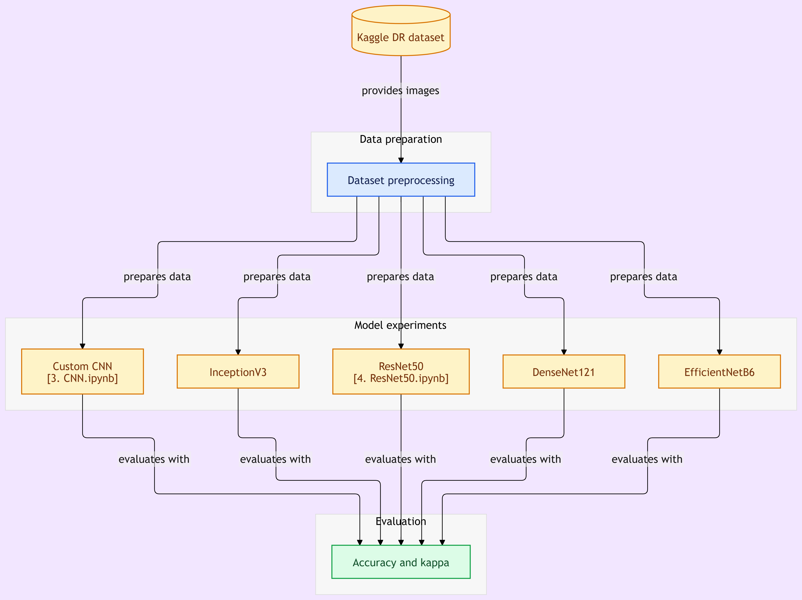
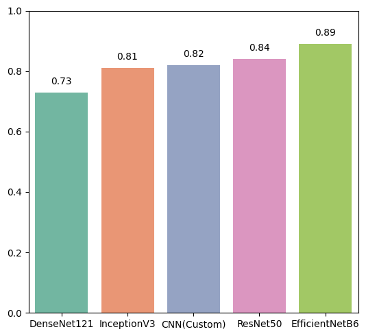

<p align="center">
  
</p>
<h1 align="center"> 🩺 Diabetic Retinopathy Severity Classification using Deep Learning</h1>

<p align="center">
A comparative deep-learning study for **5-class diabetic retinopathy (DR) severity classification** from retinal fundus photographs using a custom CNN and four pretrained architectures.
</p>
<p align="center">
  
  
  
  
</p>

<p align="center">
  
  
</p>


## 📌 Project Overview

Diabetic retinopathy is a diabetes-related eye disease that can progressively damage the retina. This project investigates whether deep-learning models can automatically classify retinal fundus images into five clinically defined severity categories.

The project performs a **comparative experiment** using:

- 🧠 **Custom CNN**
- 🏗️ **InceptionV3**
- 🧩 **ResNet50**
- 🔗 **DenseNet121**
- ⚡ **EfficientNetB6**

Each model is evaluated using:

- **Accuracy**
- **Cohen's Kappa**

The objective is to compare model behavior on the same preprocessing/evaluation pipeline and identify differences in classification performance.

> **Medical note:** This repository is an academic/research project and is **not a medical diagnostic system**. Model predictions should not be used as a substitute for assessment by a qualified clinician.

---

## ✨ Highlights

- 5-class diabetic retinopathy severity classification
- Fundus-image preprocessing pipeline
- Comparison of custom and transfer-learning architectures
- Accuracy and Cohen's Kappa evaluation
- Confusion-matrix analysis
- Reproducible Python/TensorFlow workflow
- Animated project workflow for quick visualization

---

## 🔄 Project Workflow




**Pipeline:**  
`Kaggle DR Dataset → Preprocessing → Model Experiments → Evaluation`

---

## 🗂️ Dataset

This project uses the **Kaggle Diabetic Retinopathy Detection** dataset.

The dataset contains high-resolution retinal fundus photographs captured under a variety of imaging conditions. For each subject, left- and right-eye images can be provided. Images are associated with a subject identifier and an eye designation, such as `1_left.jpeg` or `1_right.jpeg`.

### DR severity labels

| Label | Severity | Description |
|:---:|---|---|
| **0** | No DR | No diabetic retinopathy |
| **1** | Mild | Mild diabetic retinopathy |
| **2** | Moderate | Moderate diabetic retinopathy |
| **3** | Severe | Severe diabetic retinopathy |
| **4** | Proliferative DR | Proliferative diabetic retinopathy |

**Dataset:** [Kaggle Diabetic Retinopathy Detection](https://www.kaggle.com/competitions/diabetic-retinopathy-detection/data)

---

## 🧠 Models

| Model | Approach | Main idea |
|---|---|---|
| **Custom CNN** | Custom architecture | Learns convolutional features designed for this project |
| **InceptionV3** | Transfer learning | Multi-scale feature extraction using Inception modules |
| **ResNet50** | Transfer learning | Residual connections help train deep networks |
| **DenseNet121** | Transfer learning | Dense feature reuse through densely connected layers |
| **EfficientNetB6** | Transfer learning | Compound scaling of network depth, width, and resolution |

The pretrained architectures were fine-tuned/evaluated within the project's common experimental pipeline.

---

## 📊 Results

The reported experiment produced the following accuracy and Cohen's Kappa scores:

| Model | Accuracy | Cohen's Kappa |
|---|---:|---:|
| **EfficientNetB6** | **89%** | **0.86** |
| ResNet50 | 84% | 0.83 |
| Custom CNN | 82% | 0.78 |
| InceptionV3 | 81% | 0.84 |
| DenseNet121 | 73% | 0.72 |

### Accuracy visualization



### Observations from the reported experiments

- **EfficientNetB6** recorded the highest reported accuracy (**89%**) and Kappa (**0.86**).
- **ResNet50** achieved **84% accuracy** with a Kappa of **0.83**.
- The custom CNN achieved **82% accuracy** and **0.78 Kappa**.
- **InceptionV3** achieved **81% accuracy** and **0.84 Kappa**.
- **DenseNet121** achieved **73% accuracy** and **0.72 Kappa**.
- The project's confusion-matrix analysis reports that DenseNet121 had difficulty separating the **Mild** and **Moderate** classes.

> **Important:** Accuracy and Kappa can be affected by class imbalance, train/validation/test splitting, preprocessing, augmentation, and evaluation protocol. The values above are the results reported for this project.

---

## 📐 Evaluation Metrics

### Accuracy

$$
Accuracy = \frac{\text{Correct Predictions}}{\text{Total Predictions}}
$$

Accuracy represents the proportion of images that were classified correctly.

### Cohen's Kappa

$$
\kappa = \frac{p_o - p_e}{1 - p_e}
$$

where:

- $p_o$ = observed agreement
- $p_e$ = expected agreement by chance

Kappa is useful here because this is a **multi-class classification** problem and class distributions may not be uniform.

---

## 🧪 Experimental Pipeline

The general experimental flow is:

```text
┌──────────────────────────────┐
│ Kaggle DR Fundus Images      │
└──────────────┬───────────────┘
               │
               ▼
┌──────────────────────────────┐
│ Dataset Preprocessing        │
│ • Image preparation          │
│ • Label preparation          │
│ • Model-ready inputs         │
└──────────────┬───────────────┘
               │
       ┌───────┼────────┬──────────┬─────────────┐
       ▼       ▼        ▼          ▼             ▼
     CNN   Inception  ResNet50  DenseNet121  EfficientNetB6
       │       │        │          │             │
       └───────┴────────┴──────────┴─────────────┘
                         │
                         ▼
              ┌─────────────────────┐
              │ Evaluation          │
              │ Accuracy + Kappa    │
              │ Confusion Matrix    │
              └─────────────────────┘
```

---

## 🛠️ Tech Stack

- **Python**
- **TensorFlow**
- **Keras**
- **NumPy**
- **Pandas**
- **Scikit-learn**
- **OpenCV**
- **Matplotlib**
- **Seaborn**

---

## ⚙️ Installation

### 1. Clone the repository

```bash
git clone <[REPOSITORY_URL](https://github.com/sifatahammed/Diabetic-Retinopathy-Classification-using-Deep-Learning)>
cd Diabetic-Retinopathy-Classification-using-Deep-Learning
```

### 2. Create a virtual environment

#### Windows

```bash
python -m venv venv
venv\Scripts\activate
```

#### Linux/macOS

```bash
python3 -m venv venv
source venv/bin/activate
```

### 3. Install dependencies

```bash
pip install -r requirements.txt
```

If a `requirements.txt` file has not yet been created:

```bash
pip freeze > requirements.txt
```

---

## 📁 Suggested Repository Structure

```text
Diabetic-Retinopathy-Severity-Classification-using-Deep-Learning/
│
├── 📂 Figures/
│   └── score.png
│
├── 📂 experiments/
│   ├── 3_CNN.ipynb
│   └── 4_ResNet50.ipynb
│
├── 📂 assets/
│   └── dr_workflow_animation.gif
│
├── 📂 data/
│   └── README.md
│
├── 📄 README.md
├── 📄 requirements.txt
└── 📄 LICENSE
```

> Dataset files are intentionally not included in this repository. Download the dataset directly from Kaggle and follow its applicable terms of use.

---

## 🚀 Running the Experiments

Launch Jupyter Notebook:

```bash
jupyter notebook
```

Then open the relevant experiment notebook.

For example:

```text
experiments/
├── 3_CNN.ipynb
└── 4_ResNet50.ipynb
```

For a production-ready repository, consider adding separate scripts for preprocessing, training, evaluation, and inference.

---

## 🔍 Error Analysis

Accuracy alone does not show *which* DR categories a model confuses.

For this reason, the project also uses **confusion matrices** to inspect class-level behavior.

A useful analysis workflow is:

1. Generate predictions on the held-out evaluation set.
2. Build a 5 × 5 confusion matrix.
3. Inspect confusion between neighboring severity classes.
4. Calculate per-class precision, recall, and F1-score.
5. Compare errors across architectures.
6. Review incorrectly classified images for possible image-quality or labeling issues.

This is particularly useful for distinguishing visually similar neighboring severity grades.

---

## 📈 Recommended Extensions

Future experiments could investigate:

- Data augmentation strategies
- Class-weighted or focal loss
- Learning-rate scheduling
- Early stopping and checkpointing
- Stratified train/validation/test splitting
- Image-quality filtering
- Fundus-image cropping and normalization
- Per-class precision, recall, and F1-score
- ROC-AUC using one-vs-rest evaluation
- Calibration of predicted probabilities
- External validation on an independent dataset
- Explainability methods such as Grad-CAM
- Model ensembling
- Lightweight architectures for deployment

---

## 🌐 Deployment Ideas

A future version could expose the trained model through:

```text
Fundus Image
     │
     ▼
Preprocessing
     │
     ▼
Trained Model
     │
     ▼
Predicted DR Grade
     │
     ├── 0: No DR
     ├── 1: Mild
     ├── 2: Moderate
     ├── 3: Severe
     └── 4: Proliferative DR
```

Possible research/deployment interfaces include:

- Streamlit
- FastAPI
- Flask
- TensorFlow Serving

Any clinical-facing deployment would require substantially more validation, monitoring, security, and regulatory review than a research prototype.

---

### ⭐ Project Summary

**Diabetic Retinopathy Severity Classification using Deep Learning** compares a custom CNN with InceptionV3, ResNet50, DenseNet121, and EfficientNetB6 for 5-class retinal disease severity classification. The reported experiments evaluate models using **Accuracy** and **Cohen's Kappa**, with additional confusion-matrix analysis for understanding class-level errors.

## 🤝 Contributing

Contributions are welcome.

1. Fork the repository.
2. Create a feature branch:

```bash
git checkout -b feature/your-feature
```

3. Commit your changes:

```bash
git commit -m "Add your feature"
```

4. Push the branch:

```bash
git push origin feature/your-feature
```

5. Open a Pull Request.

---
## 🙏 Acknowledgements

- Kaggle Diabetic Retinopathy Detection dataset
- TensorFlow / Keras
- Scikit-learn
- OpenCV
- Matplotlib and Seaborn

---
## 👨‍💻 Author

<p align="center">
  <strong>MD Sifat Ahammed Akash</strong>
</p>
<p align="center">
  Full-Stack Developer • React Developer • AI/ML Enthusiast
</p>
<p align="center">
  <a href="mailto:sifatahammed821@gmail.com">
    
  </a>
  <a href="https://github.com/sifatahammed">
    
  </a>
</p>


## 📄 License

<div align="center">

MIT License © MD Sifat Ahammed Akash
</div>
<div align="center">
⭐ If this project is useful for your research or coursework, consider giving the repository a star!

Built with ❤️ using Python, TensorFlow, OpenCV, and Keras.

 </div>


